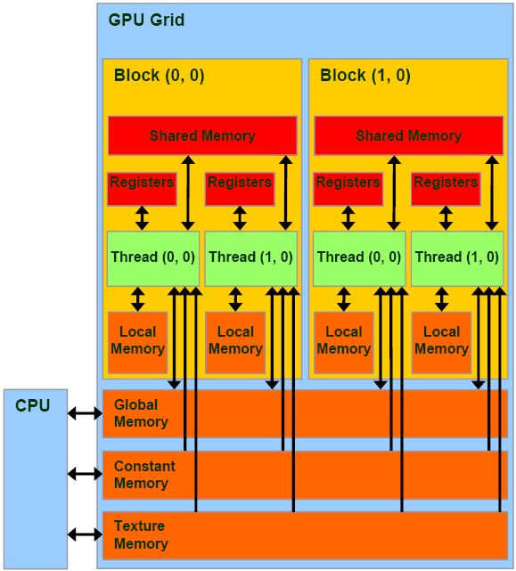

## CUDA Notes

Some frequently used commands/qualifiers/concepts are listed below for convenience

### Functions qualifers

```.cu
__global__ // launched by CPU on device (must return void)
__device__ // called from other GPU functions (never CPU)
__host__   // can be executed by CPU (can be used together with __device__)
```

### Copying memory

The memory between host and device can be copied in two ways.
The synchronous call blocks the CPU until the copy is complete.
Copy begins when all preceding CUDA calls are completed.

```.cu
cudaMemcpy (void ∗dst, const void ∗src, size_t count, enum cudaMemcpyKind kind)
```

Asynchronous call which does not block the CPU is `cudaMemcpyAsync(...)`

### Kernel launch

Kernel launches are asynchronous - Control returns to the CPU immediately.
According to [documentation](https://docs.nvidia.com/cuda/cuda-c-programming-guide/#execution-configuration) the execution configuration is defined as follows:

```.cu
f_name<<<dim3 gridDim, dim3 blockDim, size_t sharedMem, cudaStream_t strId>>>(p1,... pN)

// specifies the dimension and size of the grid.
// specifies the dimension and size of each block
// specifies the number of bytes in shared memory that is dynamically allocated per block for this call in addition to the statically allocated memory.
// specifies the associated stream, is an optional parameter which defaults to 0.
```

To block the CPU until all preceding CUDA calls have completed call

```.cu
cudaDeviceSynchronize()
```

### Dimensions of the block/grid

<center>  </center>

The gridDim and blockDim are 3D variables.
However, if the y or z dimension is not specified explicitly then the defualt value 1 is prescribed for y or z.

Declaration of the size of block/grid:

```.cu
dim3 gridDim   // This variable describes number of blocks in the grid in each dimension.
dim3 blockDim  // This variable describes number of threads in the block in each dimension.
```

#### Setting the dimensions of a kernel

Given N as the size of the problem, the block/grid dimenesions can be evalueated as:

```.cu
// if N is a friendly multiplier of THREADS_PER_BLOCK
my_kernel<<<N/THREADS_PER_BLOCK,THREADS_PER_BLOCK>>>(args)

// if N is not a friendly multiplier of THREADS_PER_BLOCK
my_kernel<<<(N + THREADS_PER_BLOCK-1) / THREADS_PER_BLOCK, THREADS_PER_BLOCK>>>(args);
```

#### Accessing threadId

Within the kernel, the following build-in variables can be referenced:

```.cu
int blockIdx  // This variable contains the block index within the grid.
int threadIdx // This variable contains the thread index within the block.
```

<!-- gridDim describes number of blocks in the grid.
blockDim describes number of threads in the block.
// dim3 dimBlock(blocksize, blocksize);
// dim3 dimGrid(N/dimBlock.x, N/dimBlock.y); -->

### Maximum number of threads in a block

The maximum number of threads in the block is limited to 1024. This is the product of whatever your threadblock dimensions are (x*y*z). For example (32,32,1) creates a block of 1024 threads. (33,32,1) is not legal, since 33\*32\*1 > 1024.

Source:

<https://devtalk.nvidia.com/default/topic/978550/cuda-programming-and-performance/maximum-number-of-threads-on-thread-block/>

<https://docs.nvidia.com/cuda/cuda-c-programming-guide/index.html#features-and-technical-specifications__technical-specifications-per-compute-capability>

### Cuda Memory Model

<center>  </center>

Readings:

<https://www.3dgep.com/cuda-memory-model/>

<https://www.microway.com/hpc-tech-tips/gpu-memory-types-performance-comparison/>

### Command line utilities

```.sh
$ nvidia-smi # NVIDIA System Management Interface program

$ cuda-memcheck # checks for memory erros within the program

$ nvprof  # command-line CUDA profiler (logger)

$ cuda-gdb # Linux and mac (debugger)
```

### Device Query

```.sh
`sudo apt-get install cuda-samples-10-2`
`cp -r /usr/local/cuda-10.2/samples/ NVIDIA_CUDA-10.2_Samples`

`~/NVIDIA_CUDA-10.2_Samples/1_Utilities/deviceQuery$ ./deviceQuery`
./deviceQuery Starting...
```

Sample output

```.sh
 CUDA Device Query (Runtime API) version (CUDART static linking)

Detected 1 CUDA Capable device(s)

Device 0: "GeForce GTX 660 Ti"
  CUDA Driver Version / Runtime Version          10.2 / 10.2
  CUDA Capability Major/Minor version number:    3.0
  Total amount of global memory:                 1993 MBytes (2089877504 bytes)
  ( 7) Multiprocessors, (192) CUDA Cores/MP:     1344 CUDA Cores
  GPU Max Clock rate:                            1020 MHz (1.02 GHz)
  Memory Clock rate:                             3004 Mhz
  Memory Bus Width:                              192-bit
  L2 Cache Size:                                 393216 bytes
  Maximum Texture Dimension Size (x,y,z)         1D=(65536), 2D=(65536, 65536), 3D=(4096, 4096, 4096)
  Maximum Layered 1D Texture Size, (num) layers  1D=(16384), 2048 layers
  Maximum Layered 2D Texture Size, (num) layers  2D=(16384, 16384), 2048 layers
  Total amount of constant memory:               65536 bytes
  Total amount of shared memory per block:       49152 bytes
  Total number of registers available per block: 65536
  Warp size:                                     32
  Maximum number of threads per multiprocessor:  2048
  Maximum number of threads per block:           1024
  Max dimension size of a thread block (x,y,z): (1024, 1024, 64)
  Max dimension size of a grid size    (x,y,z): (2147483647, 65535, 65535)
  Maximum memory pitch:                          2147483647 bytes
  Texture alignment:                             512 bytes
  Concurrent copy and kernel execution:          Yes with 1 copy engine(s)
  Run time limit on kernels:                     Yes
  Integrated GPU sharing Host Memory:            No
  Support host page-locked memory mapping:       Yes
  Alignment requirement for Surfaces:            Yes
  Device has ECC support:                        Disabled
  Device supports Unified Addressing (UVA):      Yes
  Device supports Compute Preemption:            No
  Supports Cooperative Kernel Launch:            No
  Supports MultiDevice Co-op Kernel Launch:      No
  Device PCI Domain ID / Bus ID / location ID:   0 / 1 / 0
  Compute Mode:
     < Default (multiple host threads can use ::cudaSetDevice() with device simultaneously) >

deviceQuery, CUDA Driver = CUDART, CUDA Driver Version = 10.2, CUDA Runtime Version = 10.2, NumDevs = 1
Result = PASS
```

### Acknowledgements

The wide variety of materials provided by nvidia is acknowledgement:

<https://developer.nvidia.com/cuda-education-training>
