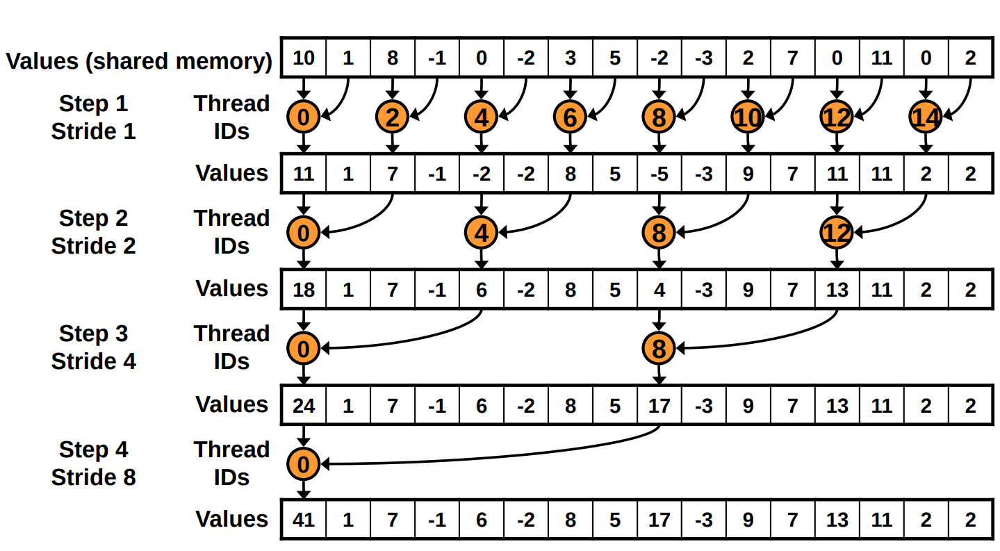

## Exercice - parallel reduction

In this exercice a parallel reduction kernel will be implemented.
Write a kernel performing the sum operation.

Starting point:

```.cpp
#include <stdio.h>

void cpu_sum(int *x, int n)
{
    int result = 0;
    for(unsigned int i=0; i < n; ++i) {
        result += x[i];
    }
    printf("CPU Sum is %d \n", result);
}

int main()
{
    int h[] = {10, 1, 8, -1, 0, -2, 3, 5, -2, -3, 2, 7, 0, 11, 0, 2};

    int size = sizeof(h);
    int count = size/sizeof(int);

    int* d;
    cudaMalloc(&d, size);
    cudaMemcpy(d, h, size, cudaMemcpyHostToDevice);

    sum <<<1, count >>>(d);

    int result;
    cudaMemcpy(&result, d, sizeof(int), cudaMemcpyDeviceToHost);
    cout << "GPU Sum is " << result << endl;

    //cpu_sum(h, count);
    cudaFree(d);
    return 0;
}

```



## Additional reading

Try to figure out the basic algorithm by your own before clicking.

<https://developer.download.nvidia.com/assets/cuda/files/reduction.pdf>
