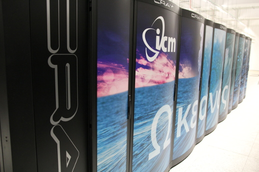

Poniżej przedstawiamy zestawienie i krótką charakterystykę maszyn obliczeniowych ICM.
Po zalogowaniu się przez ssh na węzeł dostępowy (hpc.icm.edu.pl) można ponownie użyć ssh do zalogowania się na kolejną maszynę (np. Okeanos, Rysy), niedostępna zza firewalla. Po zalogowaniu na węzeł dostępowy *hpc.icm.edu.pl* może występować on pod nazwą *hpc*.

!!! Info
    Zlecanie zadań na system `topola` możliwe jest ***bezpośrednio z węzła dostępowego*** `hpc.icm.edu.pl`.
    W przypadku pozostałych systemów możliwy/wymagany jest ***dodatkowy krok logowania*** wykonany z komputera
    hpc.icm.edu.pl, np. `ssh rysy`, `ssh okeanos`.

| Nazwa    | Typ                           | Architektura                | Liczba węzłów obliczeniowych | Parametry węzła obliczeniowego                     |
|----------| :-----------------------------| :---------------------------| :----------------------------| :--------------------------------------------------|
|Okeanos   | Superkomputer                 | Intel Haswell Cray XC40     |1084                          | 24 rdzenie, 128 GB pamięci RAM                     |
|Topola    | Klaster HPC, Klaster PL-Grid  | Intel Haswell Huawei E9000  |223                           | 28 rdzeni, 64 lub 128 GB pamięci RAM               |
|Rysy/GPU      | Klaster GPU    | Intel Skylake, NVIDIA Volta                |6                             | 36 rdzenie, 380 GB pamięci RAM, 4 GPU              |
|Rysy/PBaran | Komputer wektorowy, NEC Aurora A300-8    | Intel Xeon Gold 6126 / NEC SX-Aurora Tsubasa   | 1        | 24 rdzenie, 192 GB RAM / 8 x 8 rdzeni, 8 x 48 GB RAM  |

*Superkomputer Okeanos*
