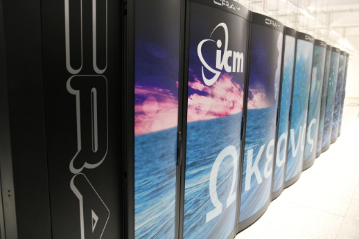

---
title:
date: 2020-03-16
draft: false
---

## ICM computer systems

The table below contains essential characteristics of the ICM computer
systems. Upon logging into the ICM access node (**hpc.icm.edu.pl**),
it is possible to ssh further onto the other supercomputers and
clusters (e.g. Okeanos of Rysy).

!!! Info
    Submitting jobs to the `topola` cluster is possible ***directly from the access node***, `hpc.icm.edu.pl`.
    To submit jobs for other systems, ***an additional ssh login step*** is required (e.g. `ssh okeanos` or `ssh rysy`.
    
| Name      | Type                           | Architecture                | No of compute nodes | Node parameters                     |
|----------- | :-----------------------------| :---------------------------| :----------------------------| :--------------------------------------------------|
|Okeanos     | Supercomputer                 | Intel Haswell Cray XC40     | 1084                         | 24 cores, 128 GB RAM                     |
|Topola      | HPC cluster, PL-Grid cluster  | Intel Haswell Huawei E9000  | 223                          | 28 cores, 64/128 GB RAM               |
|Rysy/GPU    | GPU cluster                   | Intel Skylake, NVIDIA Volta | 6                            | 36 cores, 380 GB RAM, 4x GPU V100 32GB   |
|Rysy/GPU    | GPU cluster                   | Intel Skylake, NVIDIA Volta | 1                            | 48 cores, 1500 GB RAM, 8x GPU V100 16GB   |
|Rysy/PBaran | Vector computer, NEC Aurora A300-8 | Intel Skylake, NEC SX-Aurora Tsubasa | 1           | 24 cores, 192 GB RAM / 8 x 8 cores, 8 x 48 GB RAM |

### Okeanos supercomputer

Since July 2016, ICM UW provides Okeanos supercomputer - Cray XC40
large-scale processing system. Okeanos has more than 1000 compute
nodes, each with two 12-core Intel Xeon Haswell CPU and 128 GB of
RAM. All the compute nodes are interconnected with Cray Aries network
with Dragonfly topology.

Answering the ICM technological requirements, Cray Inc. has built an
HPC system solution unique in the country. High power, scalability,
and highly efficient graph data processing are among the few of its
features. Okeanos is effectively used and dedicated to all kinds of
large-scale computational tasks that require many thousands of CPU
cores and dozens of terabytes of RAM in a single run.

Together with the analytics systems and data storage solutions,
Okeanos is the main component of the OCEAN Competence Centre
established in the new ICM Data Centre in Warsaw (Białołęka).



Okeanos supercomputer details

```text
Installation:                 Cray XC40
Name:                         Okeanos
CPU:                          Intel Xeon E5-2690 v3
Architecture:                 x86_64
Data representation:          little-endian
CPU frequency:         	      2.6 GHz
No of CPUs per node:          2 x 12 rdzenie (Hyperthreading x2)
Sockets - Cores - Threads:    2-12-2
RAM per node:                 128 GB
Filesystem:                   Lustre (rozproszony system plików)
Operating system:             SUSE Linux Enterprise Server 15
Scheduling system:            slurm 19.05.4
```

### Topola cluster

Topola cluster details

```text
Installation:                 Cluster
Name:                         Topola
CPU:                          Intel(R) Xeon(R) CPU E5-2650 v3
Architecture:                 x86_64
Data representation:          little-endian
CPU frequency:                2.0 - 3.1GHz
No of CPUs per node:          28 rdzeni
Sockets - Cores - Threads:    2-14-1
RAM per node:                 64/128 GB
Filesystem:                   NFS/lustre/ext4
Operating system:             CentOS 7
Scheduling system:            slurm 18.08.9
```

Topola cluster nodes

| CPU model                             | CPU frequency  | Sockets: Cores: Threads | RAM    | No of nodes | Name                       |
|---------------------------------------| :----------------| :---- ------------------| :------| :-------------| :---------------------------|
|Intel(R) Xeon(R) CPU E5-2697 v3        | 2.1GHz - 3.0GHz  | 2:14:1                  | 128 GB | 60            | t1-[1-12], t[13-15]-[1-16]  |
|Intel(R) Xeon(R) CPU E5-2697 v3        | 2.1GHz - 3.0GHz  | 2:14:1                  | 64  GB | 163           | t1-[13-16], t[2-12]-[1-16]  |

Topola cluster nodes differ in RAM memory available only. The
scheduling system assigns the node type according to the memory
requirement submitted by the user.

### Rysy cluster

Rysy cluster details

```text
Installation:                 Cluster
Name:                         Rysy
CPU:                          Intel(R) Xeon(R) Gold 6154/6252 CPU
Architecture:                 x86_64
Data representation:          little-endian
CPU frequency:                2.1/3.0 - 3.7GHz
No of CPUs per node:          36 rdzeni
Sockets - Cores - Threads:    2-18-1
RAM per node:                 380/1500 GB
Filesystem:                   nfs4/lustre
GPU:                          NVIDIA Tesla V100 16/32GB
Operating system:             CentOS 7
Scheduling system:            slurm 20.02.3
```

Rysy cluster nodes

| CPU model                             | CPU frequency   | Sockets: Cores: Threads | RAM      | GPU                    | No of nodes | Name            |
|---------------------------------------| :----------------| :---- ------------------| :--------| :--------------------------| :---------| :----------------|
|Intel(R) Xeon(R) Gold 6252             | 3.0GHz - 3.7GHz  | 2:18:1                  | 380 GB   | 4x NVIDIA Tesla V100 32GB  |  6        | rysy-n[1-6]      |
|Intel(R) Xeon(R) Gold 6154             | 2.1GHz - 3.7GHz  | 2:24:1                  | 1500 GB  | 8x NVIDIA Tesla V100 16GB  |  1        | rysy-n7          |
|Intel(R) Xeon(R) Gold 6126             | 2.6GHz - 3.7GHz  | 2:12:1                  | 192 GB   | 8x NEC Vector Engine Type 10B 48GB  |  1        | pbaran           |

## System information (hardware)

The following commands allow to display system information:

```text
scontrol show partition <partition-name>        # partition characteristics
scontrol show node <node-name>                # node characteristics

cat /etc/os-release     # operating system version
df -Th                  # filesystem information

lscpu                   # CPU architecture (note: compute node architecture may be different than the access node)
sinfo -N -l             # number of nodes
sinfo -l -N | awk '{printf ("%1s %15s %15s %15s %10s %10s \n", $1, $2, $3, $5, $6, $7)}' # columns formatting
smap -i 2               # semi-graphical node-usage information
```

## QOS - Quality of Service

### Topola - qos

```.sh
[username@hpc ~]$ sacctmgr show qos format=name,MaxWall,Priority,MaxTRESPU%50


      Name     MaxWall   Priority                                     MaxTRESPU
---------- ----------- ---------- ---------------------------------------------
    normal                      0
       hpc  7-00:00:00        750
    plgrid  7-00:00:00        750
       egi  7-00:00:00        500
     meteo                   1500  
```

### Okeanos - qos

```.sh
okeanos-login1 /home/username> sacctmgr show qos format=name,MaxWall,Priority,MaxTRESPU%50


      Name     MaxWall   Priority                                     MaxTRESPU
---------- ----------- ---------- ---------------------------------------------
    normal                      0
       hpc  2-00:00:00        750
     ocean  4-00:00:00       1000                                     node=1024
ocean-long  7-00:00:00        750                                      node=256
```

### RYSY - qos

```.sh
username@rysy ~ $ sacctmgr show qos format=name,MaxWall,Priority,MaxTRESPU%50


      Name     MaxWall   Priority                                     MaxTRESPU
---------- ----------- ---------- ---------------------------------------------
    normal  2-00:00:00        100                                        node=2
     limit    06:00:00        100            cpu=8,gres/gpu=1,gres/ve=1,mem=90G
     short    00:15:00      10000
      prio  2-00:00:00      10000
      long  7-00:00:00          1     cpu=8,gres/gpu=1,gres/ve=1,mem=90G,node=1
      none                      0                                         cpu=0
```

Abbreviations:

- *TRES* - Trackable RESources. A TRES is a resource that can be tracked for usage or used to enforce limits against

- *PU* - Processing Unit.
