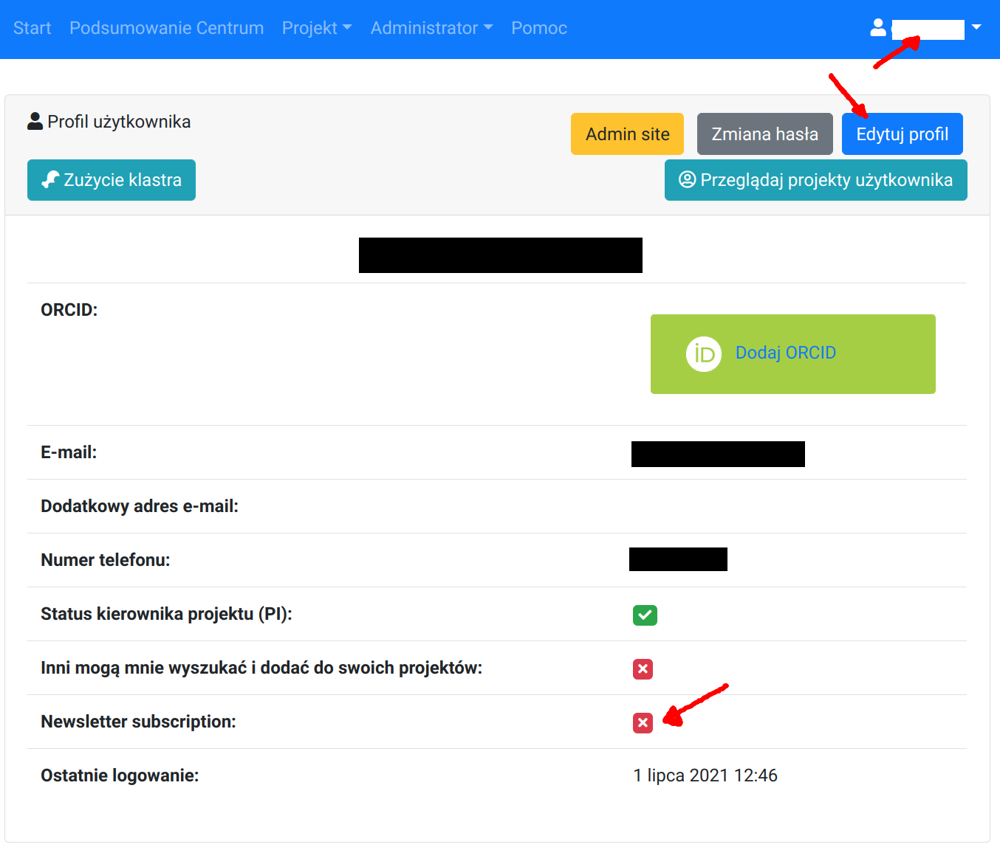
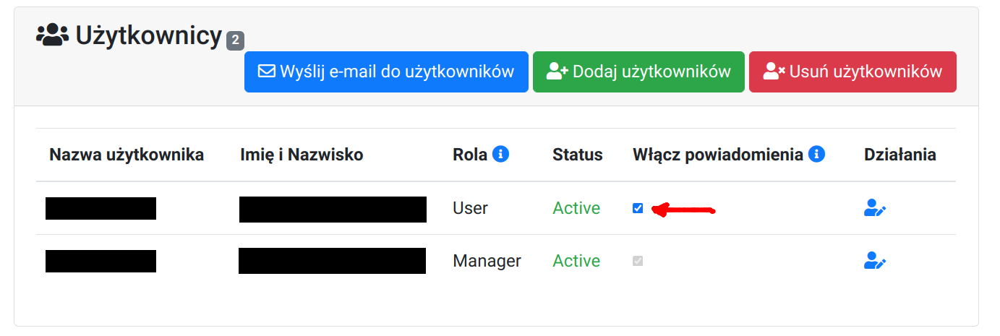

# Powiadomienia

Użytkownicy ICM mogą otrzymywać następujące rodzaje powiadomień

| Rodzaj powiadomienia                      | Dla kogo                | Zarządzanie powiadomieniami      |
| :-----------------------------------------| :-----------------------| :--------------------------------|
| Newsletter (kursy, webinary, konferencje) | Dla chętnych            | Profil użytkownika.              |
| Powiadomienia z projektów                 | Użytkownicy projektu    | Na stronie projektu. Powiadomienia są obowiązkowe dla Kierownika projektu (PI). |
| Powiadomienia serwisowe i administracyjne | Wszyscy                 | Powiadomia są obowiązkowe.       |

Poniżej przedstawiono zrzuty ekranu (screenshots) związane z zarządzaniem powiadomieniami.

## Profil użytkownika

## Powiadomienia z projektu

