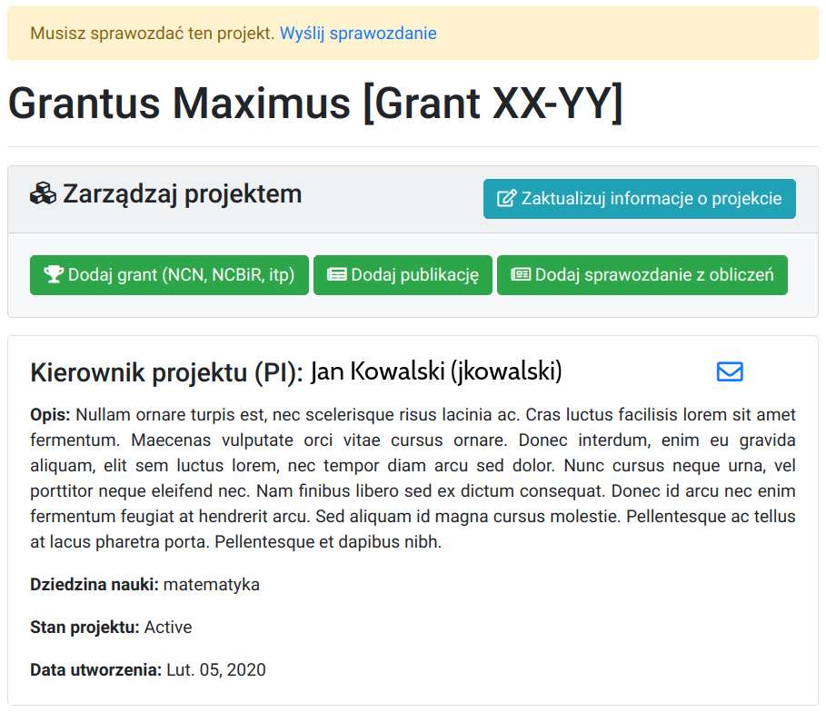

# Rozliczenie Projektu

Rozliczanie projektu odbywa się raz do roku, najczęściej na przełomie lutego/marca.

Przypomnienie o konieczności złożenia sprawozdania przesyłane jest mailem do wszystkich kierowników projektów oraz współwykonawców. Sprawozdanie do bazy wstawia kierownik projektu (PI).

Zadaniem kierownika jest podsumowanie obliczeń w projekcie i uzasadnienie wykorzystania zasobów ICM.

## Po co składać sprawozdanie

!!! info "Dlaczego sprawozdania są ważne?"
    Sprawozdania służą do pozyskiwania oraz rozliczania środków finansowych przeznaczonych na rozbudowę, utrzymanie Centrum Obliczeniowego (w tym zakup serwerów obliczeniowych) i dostęp do możliwości obliczeniowych (koszty energii, serwis techniczny, wsparcie techniczne dla prowadzących obliczenia, itp).

    Nie złożenie sprawozdania przez kierownika projektu może skutkować zamknięciem projektu. 

    Wam i Nam zależy aby obliczenia naukowe odbywały się niekomercyjnie.

## Jak przygotować sprawozdanie

Sprawozdanie powinno zawierać:

- podsumowanie działań i wyników obliczeń
- informacje o wykorzystywanym oprogramowaniu
- informacje o maszynach na których prowadzone były obliczenia
- ilość wykorzystanych zasobów (CPUh)
- informację o możliwości stosowania obliczeń równoległych
- krótką informacje o grantach (NCN, NCBiR, FP7 i inne) w których wykorzystywane są obliczenia prowadzone w ICM
- publikacje związane z grantem obliczeniowym
- informacje o wypromowanych pracach magisterskich i doktorskich
- sprawozdanie powininno zawierać tylko tekst (bez wykresów, bez załączników, itp).

Warto pamiętać o sprawdzeniu:

- streszczenia projektu
- danych kierownika oraz współwykonawców (prosimy pamiętać o aktualizacji tytułów naukowych, telefonów kontaktowych oraz maili).

### Publikacje

Wszystkie publikacje związane z projektem obliczeniowym powinny być
zamieszczane na stronie projektu oraz zawierać następującą informację:

!!! Info
    This research was carried out with the support of the
    Interdisciplinary Centre for Mathematical and Computational Modelling
    ICM) University of Warsaw under computational allocation no Gxx-xx

## Jak złożyć sprawozdanie

Od 2021r. sprawozdanie należy składać poprzez <https://granty.icm.edu.pl>.

Jeśli nie prowadziłeś obliczeń (lub dopiero je zacząłeś), lub z innych powodów nie zamieszczasz sprawozdania kliknij w `Wyślij sprawozdanie` i wypełnij na dole strony **tylko jedno** pole: `Powód nieaktualizowania projektu`. 

Poniżej szczegółowa instrukcja.

### Logowanie

Logujemy się korzystając z nazwy użytkownika i hasła takiego jak na serwer dostępowy (`hpc.icm.edu.pl`).

  

### Wybór projektu

Wybieramy projekty które wymagają sprawozdania.

  

### Streszczenie Projektu

Jeżeli streszczenie wymaga aktualizacji, to należy kliknąć w `Zaktualizuj informacje o projekcie`.

  

### Publikacje

Warto zauważyć, że w celu dodania publikacji wystarczy jej DOI.

  

### Sprawozdanie

Uzupełniamy pozostałe dane: `Powiązane Granty (NCN, NCBiR itp)`, `Publikacje` oraz `Sprawozdanie`.
W sekcji `Powiązane Granty` należy podać informację o zródle finansowania badań naukowych, np. NCN, NCBiR, grant wewnętrzny Uniwersytetu X.

  

### Wyślij sprawozdanie

W celu wysłania sprawozdania należy kliknąć w link `Wyślij sprawozdanie` na górze strony.

  

### Zatwierdź

Kliknij w `Zatwierdź` aby wysłać sprawozdanie (zmiany nie będą później możliwe). Gotowe.

  

