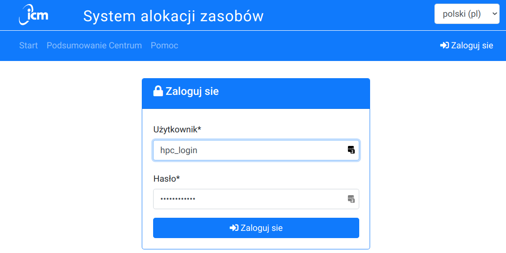
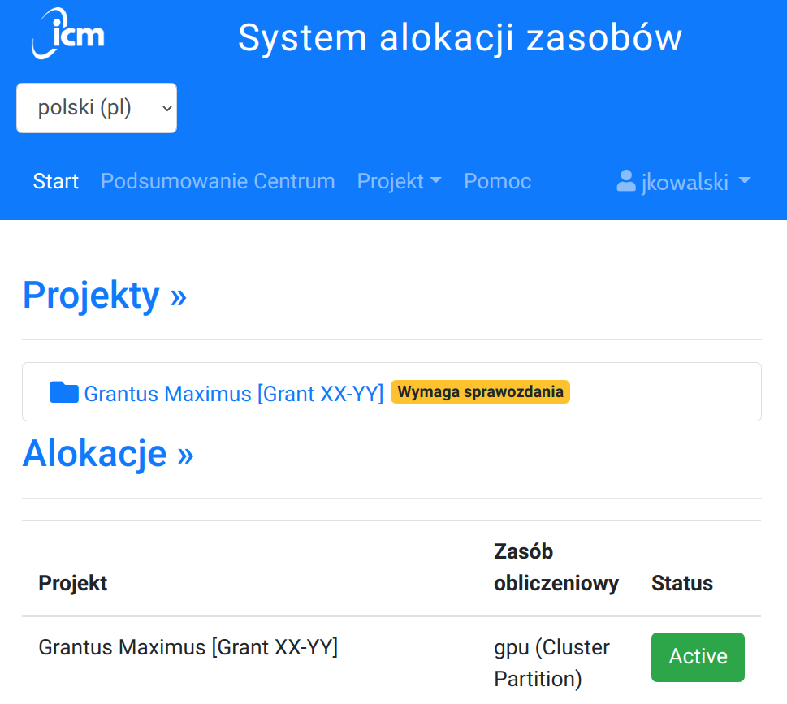
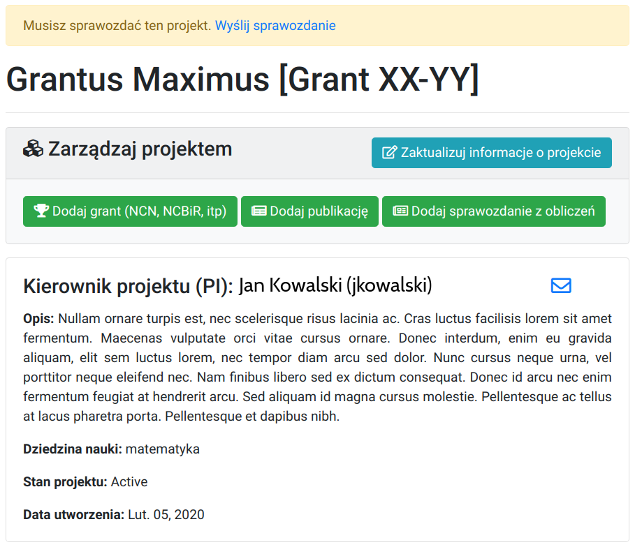
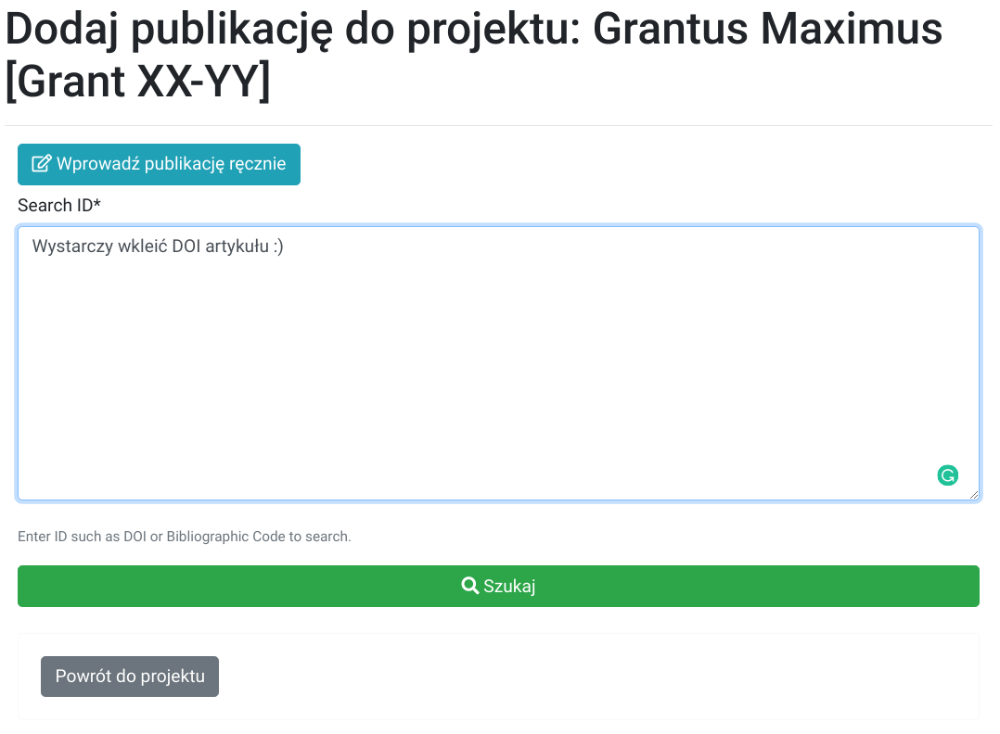
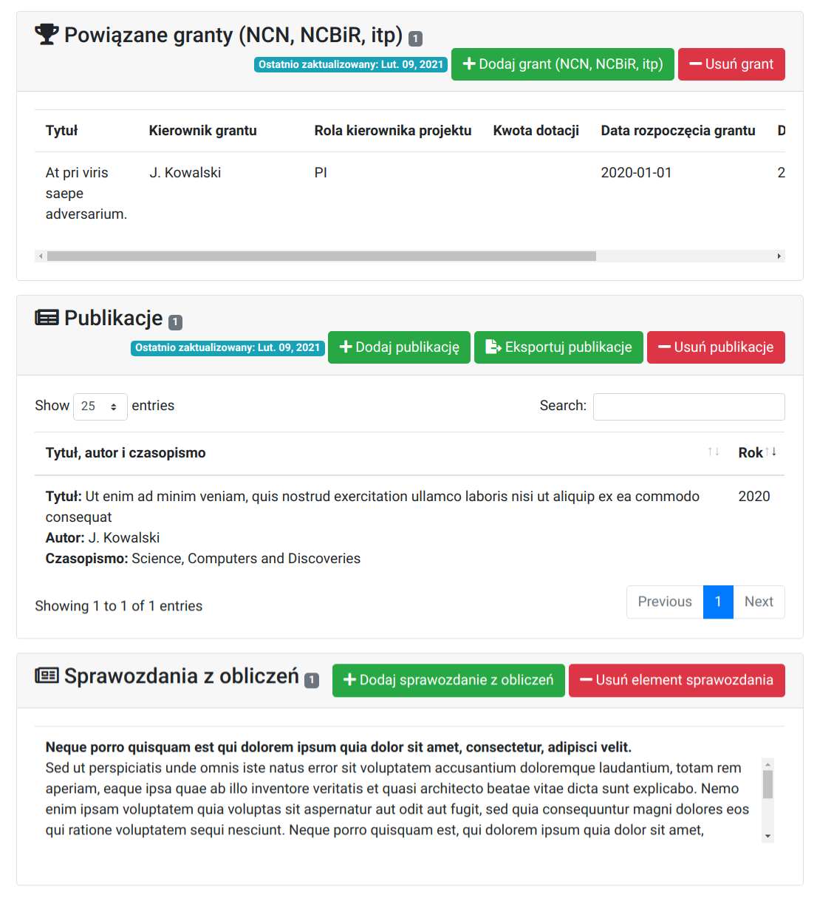
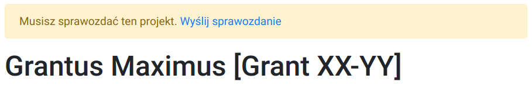
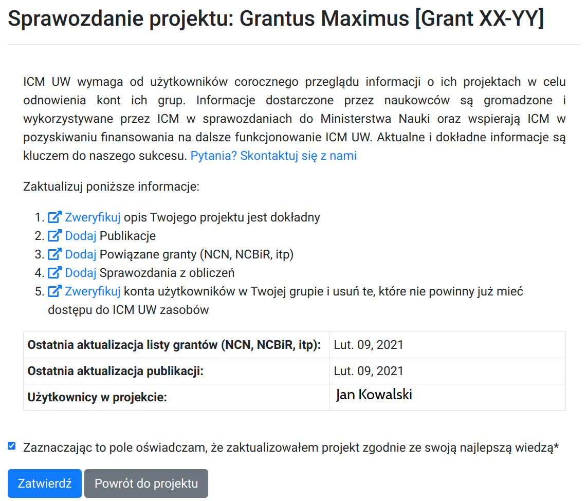

# Project report

The project is reported once a year, usually at the turn of February / March.

A reminder sent in advance by e-mail to principal investigator and users.
The report shall be submited into the system by the principal investigator (PI).

The PI's task is to summarize the project calculations and justify the use of ICM resources.

## Why shall you submit the report

!!! info "Why are reports important?"
    The reports are required to obtain funds for the development and maintenance of the Computing Center (including the purchase of computing servers) and access to computing capabilities (energy costs, technical service, technical support for calculators, etc.).

    Failure to submit a report by the principal investigator may result in the closure of the project.

    Both, you and us wish to keep the scientific calculations non-commercial.

## How to prepare a report

The report should include:

- summary of activities and results of calculations
- information about the software used
- information about the machines on which the calculations were carried out
- the amount of resources used (CPUh)
- information about the possibility of using parallel calculations
- short information on grants (NCN, NCBiR, FP7 and others) in which calculations conducted at ICM are used
- publications related to the computational grant
- information on promoted master's and doctoral theses
- the report should contain only text (no diagrams, no attachments, etc.).

It is worth remembering to verify:

- project summaries
- contact details of PI and users (please remember to update academic titles, telephone numbers and e-mails).

### Publications

All publications related to the project should be
included on the project's website and contain the following information:

!!! Info
    This research was carried out with the support of the
    Interdisciplinary Centre for Mathematical and Computational Modelling
    ICM) University of Warsaw under computational allocation no Gxx-xx

## How to submit the report

Since 2021 the report should be submitted via <https://granty.icm.edu.pl>.

If you have not carried out the calculations (or have just started them), or for other reasons you are not submitting the report, click on `Send report` and fill out only **one field** at the bottom of the page: 'Reason for not updating the project'.

Detailed instructions below.

### Login

Log in using the username and password as for the access server (`hpc.icm.edu.pl`).

  

### Project selection

Select projects that require a report.

  

### A summary of the project

If the abstract requires updating, click on `Update project information`.

  

### Publications

Note that you only need DOI to add a publication.

  

### Report

Complete the remaining data: `Related Grants (NCN, NCBiR, etc.)`, `Publications` and `Report`.
In the `Related Grants` section, please provide information on the source of research funding, e.g. NCN, NCBiR, University X internal grant.

  

### Send report

To send a report, click on the `Send report` link at the top of the page.

  

### Confirm

Click on `Confirm` to send the report (changes will not be possible later). Done.

  

