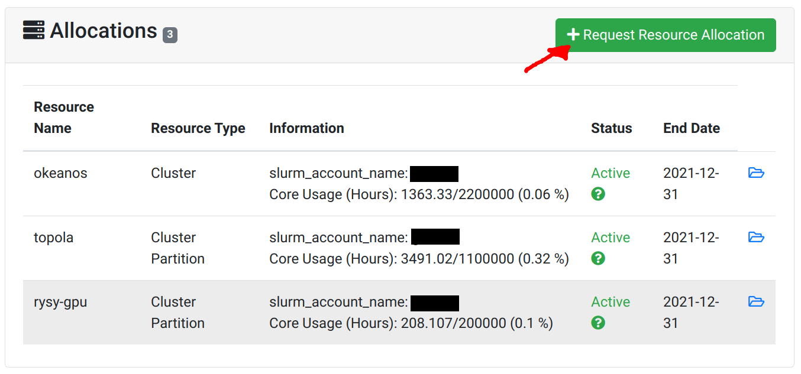

# Create an allocation

To perform calculations in a project, the [Principal Investigator (PI)](./zakladanie_konta.en.md#principal-investigator) shall create an allocation.
On the project's page, click on `Request Resource Allocation`.
Select the supercomputer you want to use.
The application must specify the amount of computing resources (CPUh - core hours).
The description should focus on the **computational** aspect of the research.

Details regarding the resources provided by ICM:

* [Avalaible supercomputers - Okeanos, Topola, Rysy](../O_zasobach_ICM/Zasoby/komputery_w_icm.en.md)
* [Types of allocations](./rodzaje_alokacji.en.md)

  

