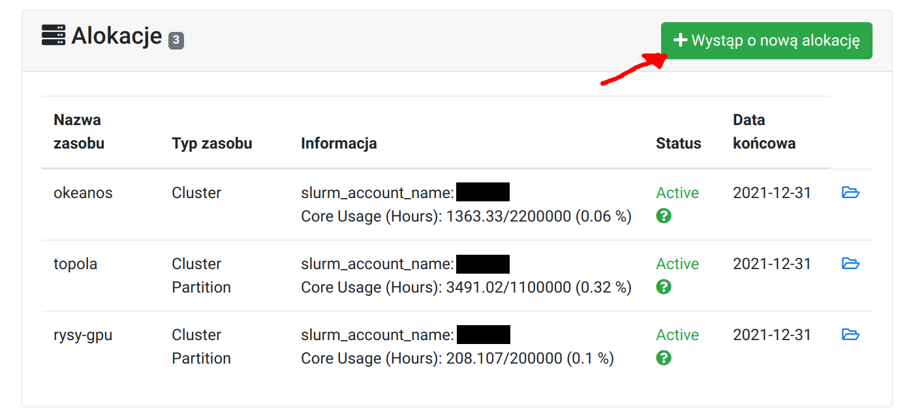

# Wnioskowanie o alokację

Aby móc realizować obliczenia w ramach projektu, [Kierownik projektu (PI)](./zakladanie_konta.pl.md#kierownik-projektu) powinien wystąpić o alokację.
Na stronie projektu należy kliknąć w `Wystąp o nową alokację`.
Należy wybrać superkomputer z którego chcemy korzystać.
We wniosku należy podać ilość zasobów obliczeniowych (CPUh - rdzeniogodziny).
Opis powinien być skoncetrowany na **obliczeniowym** aspekcie badań.

Informacje o zasobach udostępnianych przez ICM:

* [Dostępne superkomputery - Okeanos, Topola, Rysy](../O_zasobach_ICM/Zasoby/komputery_w_icm.pl.md)
* [Rodzaje alokacji](./rodzaje_alokacji.pl.md)

  

