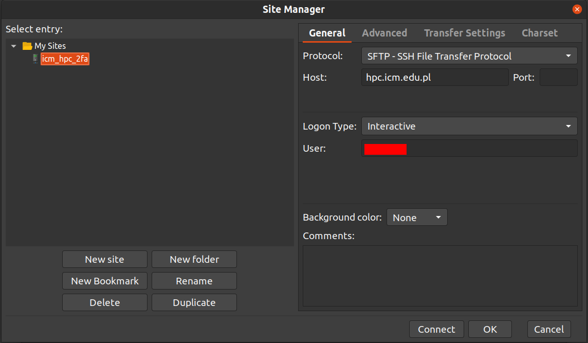

Do kopiowania plików używa się komendy cp:
`cp source_file somewhere/target_dir/`

Katalogi można kopiować komendą `cp` z opcją `-r` (recursive):
`cp -r source_dir somewhere/target_dir/`

Podczas kopiowania można używać uogólnionych nazw z `\*`:

- `*` – wszystkie pliki/katalogi
- `*.roz` – wszystkie pliki z rozszerzeniem .roz
- `a*` – wszystkie pliki/katalogi zaczynające się od a

## Rozmiar kalalogów

Do sprawdzenia rozmiaru katalogu można użyć komendy:

```.sh
du -hc katalog/

Do sprawdzenia zajętej przestrzeni dyskowej

```.sh
lfs quota -uh $USER /lu/tetyda/home/$USER
lfs quota -uh $USER /lu/topola/home/$USER/  # użytkownicy plgrid
```

### Kopiowanie plików - SSH

Aby przegrać pliki pomiędzy maszynami korzystamy z polecenia *scp*.
Składnia jest taka jak przy zwykłym kopiowaniu *cp*.

Przydatne opcje:

| Opcja    | Znaczenie                                                              |
|----------| :----------------------------------------------------------------------|
| -C       |  włącza kompresję (w przypadku pliku skompresowanego nie ma to sensu)  |
| -p       |  zachowuje oryginalną datę stworzenia pliku                            |
| -r       |  (recursive) kopiowanie całego podkatalogu                             |
| -v       |  (verbose) przydatne, jeśli nie udaje nam się połączyć                 |

Uwagi:

- swój katalog domowy można zastąpić przez znak `~`
- nie podanie ścieżki spowoduje wgrywanie plików względem katalogu domowego
- Sprawdzenie dostępnego miejsca w katalogu użytkownika `quota -v login_uzytkownika`

**Przykłady:**

```.sh
# Kopiowanie pliku do ICM:
    scp -C -p plik.tar.gz username@hpc.icm.edu.pl:.
# Kopiowanie pliku z ICM:
    scp -C -p username@hpc.icm.edu.pl:plik.tar.gz destination_folder
# Kopiowanie zawartości katalogu do ICM:
    scp -r -C -p source_folder username@hpc.icm.edu.pl:destination_folder
# Kopiowanie zawartości katalogu z ICM:
    scp -r -C -p username@hpc.icm.edu.pl:source_folder destination_folder
# Kopiowanie z hpc na okeanos/rysy - nie zalecane, łatwiej poprzez zasób współdzielony
    scp -r -C -p source_folder username@okeanos:/home/username
    scp -r -C -p source_folder username@rysy:/home/username
```

### Synchronizacja i montowanie katalogów

```.sh
# Zamontowanie zdalnego folderu na lokalnej maszynie
    sshfs user@your.server.example.com:/source_folder destination_folder

# Synchronizacja (tylko nowe pliki) zawartości lokalnego folderu ze zdalnym (lub vice versa)
    rsync -avzhe ssh --progress source_folder/  user@your.server.example.com:/destination_folder/

# Synchronizacja z zastrzeżeniem do plików `.csv` i zachowaniem struktury katalogów
    rsync -zarv --prune-empty-dirs --include "*/"  --include="*.csv" --exclude="*" "$FROM" "$TO"
```

## Kopiowanie poprzez zasób współdzielony

!!! info
    Szczegóły zasobów dyskowych ICM opisane są [tu](../../O_zasobach_ICM/Zasoby/przechowywanie_danych.md).

Maszyny ICM'u dysponują współdzielonymi systemami plików.
Można na nich operować tak, jak na dysku lokalnym (kopiowanie za pomocą cp).
Do zasobów współdzielonych należą:

```.sh
/lu/tetyda/home/$USER/
```

Katalog domowy okeanosa `/lustre/tetyda/home/` jest widoczny pod scieżką `/lu/tetyda/home/user_name/` z węzła dostępowego na topoli.

## Udzielenie dostępu do danych dla członków tego samego grantu

Najlepszym sposobem na przekaznie dostępu do plików w ramach grantu jest użycie mechanizmu praw dostępu do pliku w Linux.
W tym celu należy najpierw ustawić właściwą grupę dla plików które nas interesują,
a następnie prawo odczytu (i zapisu jeżeli dotyczy) dla tej grupy.

Przykładowo, jeżeli grant ma numer `GBXX-YY`,

1. Zmieniamy grupę główną w powłoce:  

    `$ newgrp GBXX-YY`

2. Ustawiamy własność dla tej grupy dla plików:

    `$ chgrp GBXX-YY  nazwa_pliku`

    opcja `-R` pozwala robić to rekursywnie dla katalogów

3. Ustawiamy prawa dla członków grupy:

    `$ chmod g+r nazwa_pliku # odczyt`

    `$ chmod g+w nazwa_pliku # zapis`

## Klient FTP

Do transferu plików można wykorzystać (darmową) aplikacje, np `FileZilla`.

W trakcie dwu etapowej autoryzacji (2FA) wymagane jest podanie hasła [OTP](../Logowanie/ssh.pl.md).

W kliencie FTP konieczne jest ustawienie logowania w trybie interaktywnym.

Przykładowo, dla aplikacji `FileZilla` konfiguracja wygląda następująco:

- W lewym górnym rogu kliknij `File` --> `Site Manager...`



- Wpisz hasło [OTP](../Logowanie/ssh.pl.md)


