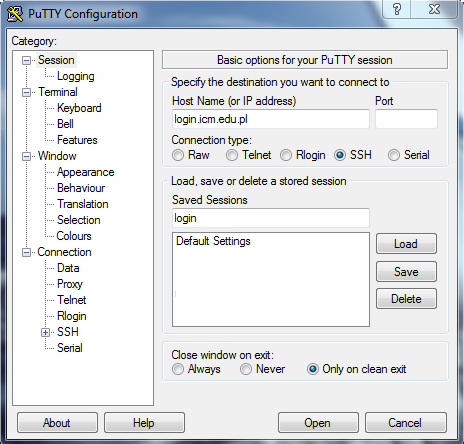
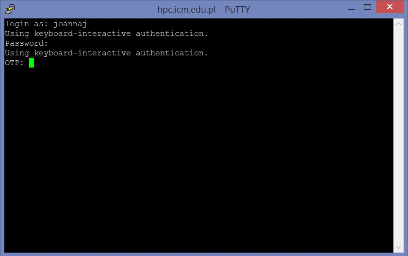
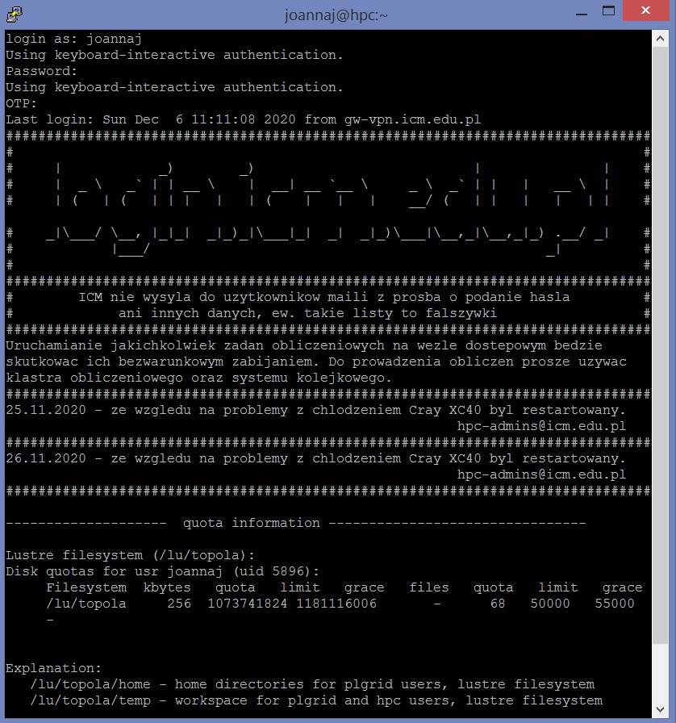

## Access to the ICM from a Windows computer

### Logging in from the terminal level

Modern versions of Windows 10 provide an ssh client from PowerShell (command interpreter) in text mode. After starting the PowerShell window, run the command `ssh hpc.icm.edu.pl` and follow the instructions on the [SSH login] page (./ssh.en.md).

### Graphic client (PuTTY)

Download the PuTTY program, available at (it is executable - ready to use):

<http://the.earth.li/~sgtatham/putty/latest/x86/putty.exe>

Run the downloaded program.
A window similar to the following is displayed:

  

- In the field **Host Name (or IP address)** enter **hpc.icm.edu.pl**
    (access machine address) and click the **Open** button.

- When logging in for the first time, a window with a related message will appear access key. The key should be confirmed by selecting the 'YES' option

Authorization is two-factor (2FA). A terminal appears in which we are asked to provide:

- username and password
- [OTP](./ssh.en.md) (one time password, see [two-factor authentication](./ssh.en.md#two-factor-authorization-2fa))

  

After entering both values ​​we are on the access computer *hpc.icm.edu.pl*
(this computer may also be called *hpc*):

  

Computers in the ICM network are equipped with operating systems from the UNIX family.
