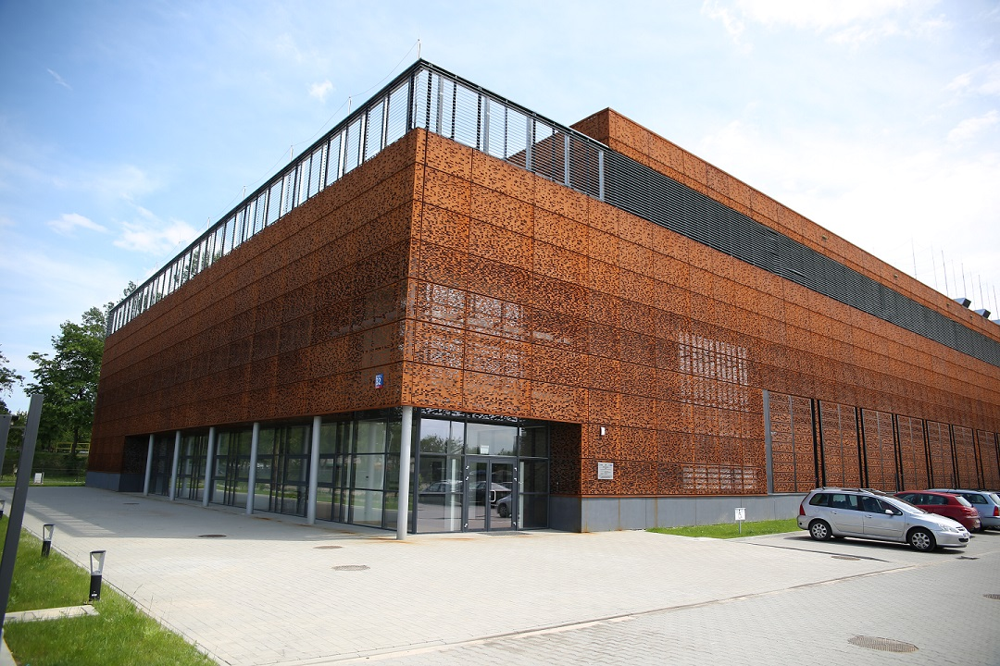

# ICM UW Documentation

ICM UW provides High Performance Computing (HPC) infrastructure to
researchers and commercial entities.

  

*ICM Technology Centre*

## About us

Interdisciplinary Centre for Mathematical and Computational Modelling,
University of Warsaw ([ICM UW](https://icm.edu.pl/)) is one of the
leading European supercomputing centres providing innovative solutions
for science, administration, and business. ICM's offer includes
supercomputing resources for advanced computational research,
optimised high-performance scientific software, complex modelling,
simulations, as well as data processing, analysis and visualisation.

For our users, we maintain a software base dedicated for
high-performance computer systems. Our portforio includes projects for
both public and private sectors (energy, environment, transport,
medicine). Since 2018, ICM organises international Supercomputing
Frontiers Europe conference dedicated to visionary trends and
innovations in HPC.

Some of ICM's most recognisable projects include:

- <http://www.meteo.pl/> - meteorological service utilising numerical weather
  forecasts.
- HPC hackathons and programming challenges.
- second-degree (MSc) studies in computational engineering.
- epidemiological model for Poland <https://covid-19.icm.edu.pl/>

<iframe width="952" height="380" src="https://www.youtube.com/embed/S5bn9t2EHV8" frameborder="0" allow="accelerometer; autoplay; encrypted-media; gyroscope; picture-in-picture" allowfullscreen></iframe>
